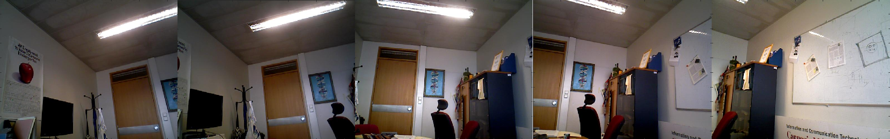
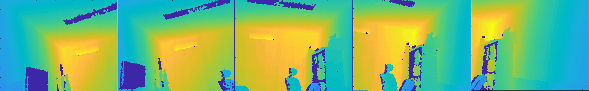

# 3DReconstruction

This project was developed for the Computer Vision course. The objective is to create a 3D reconstruction of a scene from a sequence of RGB and depth images (with guaranteed overlap between consecutive images) in Matlab. For example, from the following sequence of overlapping RGB images:

and depth images:

we obtain the following 3D point cloud:

